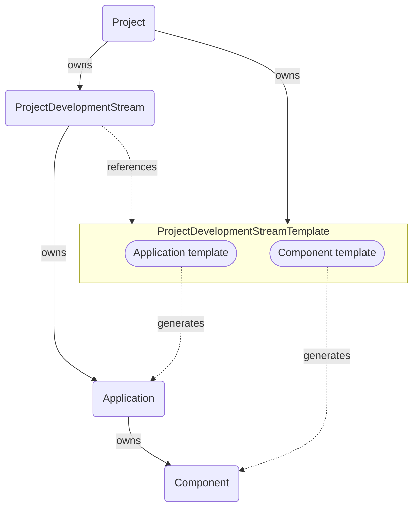

# project-controller
Allow users to manage projects and development streams in Konflux

- A *Project* is used to describe a major piece of software that can be worked
  on by multiple teams over an extended period of time. A project may contain
  one or more development streams.
- A *ProjectDevelopmentStream* indicates an independent stream of development.
  A *ProjectDevelopmentStream* can contain one or more *Application*s each
  containing one or more *Component*s.
- Starting a new development stream involves creating a large amount of
  *Application* and *Component* resources. This controller helps to streamline
  that by allowing to create a *ProjectDevelopmentStreamTemplate* resource
  that specifies the resources to be created and allows for using variables to
  customize them. Using a template, many similar development streams can be
  created quickly.



## Using this controller

### Create a project

```
apiVersion: projctl.konflux.dev/v1beta1
kind: Project
metadata:
  name: my-project
spec:
  displayName: "My cool project"
  description: |
    Description of my project.
```

### Create a ProjectDevelopmentStreamTemplate

You can use the [Go text/template][gt] syntax to place template variable values
into various resource attributes as well as variable default values. Also note
the use of the custom `hyphenize` template function to create a value suitable
for use in resource names.

```
apiVersion: projctl.konflux.dev/v1beta1
kind: ProjectDevelopmentStreamTemplate
metadata:
  name: my-project-template
spec:
  project: my-project
  variables:
  - name: version
    description: A version number for a new development stream
  - name: versionName
    description: A K8s-compliant name for the version
    defaultValue: "{{hyphenize .version}}"

  resources:
  - apiVersion: appstudio.redhat.com/v1alpha1
    kind: Application
    metadata:
      name: "cool-app-{{.versionName}}"
    spec:
      displayName: "Cool App {{.version}}"

  - apiVersion: appstudio.redhat.com/v1alpha1
    kind: Component
    metadata:
      name: "cool-comp1-{{.versionName}}"
    spec:
      application: "cool-app-{{.versionName}}"
      componentName: "cool-comp1-{{.versionName}}"
      source:
        git:
          context: "."
          dockerfileUrl: "Dockerfile"
          revision: "{{.version}}"
          uri: git@github.com:example/comp1.git

  - apiVersion: appstudio.redhat.com/v1alpha1
    kind: Component
    metadata:
      name: "cool-comp2-{{.versionName}}"
    spec:
      application: "cool-app-{{.versionName}}"
      componentName: "cool-comp2-{{.versionName}}"
      source:
        git:
          context: "."
          dockerfileUrl: "Dockerfile"
          revision: "{{.version}}"
          uri: git@github.com:example/comp2.git
```

[gt]: https://pkg.go.dev/text/template

### Create one or more ProjectDevelopmentStream resources

*ProjectDevelopmentStream* resources may include an optional `template` section
that references a *ProjectDevelopmentStreamTemplate* resource. That causes the
resources defined by the template resource to be created. If the template
defines any variables that lack default values, the values need to be provided
using a `values` section. Values may optionally also be provided for variables
that do include default values.

```
apiVersion: projctl.konflux.dev/v1beta1
kind: ProjectDevelopmentStream
metadata:
  name: my-project-1-0-0
spec:
  project: my-project
  template:
    name: my-project-template
    values:
    - name: version
      value: "1.0.0"
```

By defining multiple *ProjectDevelopmentStream* resources that refer to the same
template, we may quickly create development streams and the resources needed for
them.

```
apiVersion: projctl.konflux.dev/v1beta1
kind: ProjectDevelopmentStream
metadata:
  name: my-project-2-0-0
spec:
  project: my-project
  template:
    name: my-project-template
    values:
    - name: version
      value: "2.0.0"
```

### What do we get

Given the resources above, we end up with two *Application* resources, where
each owns two *Component* resource so that each two components are using
different branches of the `git@github.com:example/comp1.git` and
`git@github.com:example/comp2.git` repositories respectively. The branch names
are identical to the version numbers in this example. More complex relationships
may be defined using the template syntax.

## Known limitations

The following limitations exist in the current controller implementation and are
likely to be resolved in the future.

* If a resource created by a template is modified, the configuration is not
  aligned back with the template unless either:
    - The controller gets restarted
    - The *ProjectDevelopmentStream*, *ProjectDevelopmentStreamTemplate* or the
      *Project* resources that generated the resource are modified
* A *ProjectDevelopmentStream* that isn't referring a template may be modified
  to refer to a template. Similarly, the template *ProjectDevelopmentStream* is
  referring to may be changed. In both those cases, resources owned by the
  *ProjectDevelopmentStream* but not defined by the new template do not get
  deleted.
